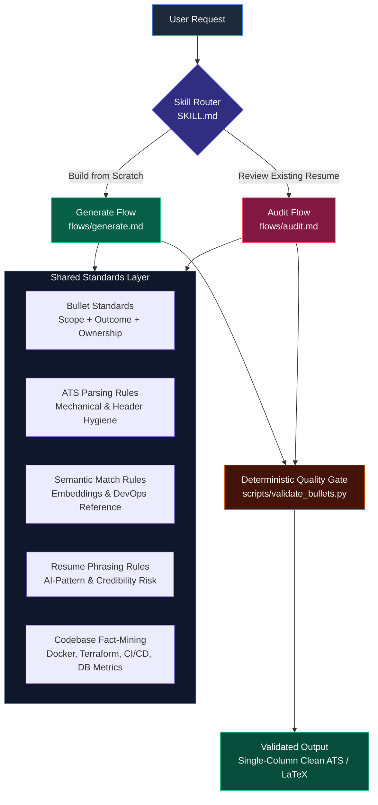

<div align="center">

# 📄 Resume Builder (ATS & Humanized Engineering)

**An evidence-backed Agent Skill that crafts, humanizes, and audits technical resumes.**  
*Combines modern ATS semantic search realities, recruiter F-pattern scan rules, and structural debiasing to eliminate AI tells.*

[](LICENSE)
[](https://skills.sh/prathameshlonare/resume-builder)
[](https://github.com/prathameshlonare/resume-builder/actions/workflows/test.yml)
[](scripts/validate_bullets.py)
[](SKILL.md)
[](scripts/validate_bullets.py)
[](references/ats-detection-research.md)

<br>

**1 skill • 2 execution flows • 4 booming 2026 fresher tracks • 8 deterministic quality gates**

> **Not an AI-detector bypass trick.**  
> The goal is unassailable technical credibility: bullets grounded in real codebase metrics, verified git artifacts, and active engineering phrasing that survives both semantic ATS parsers and rigorous technical interview screens.

</div>

---

## ⚡ Core Flows & Commands

| Flow / Command | Target Input | Primary Output |
| :--- | :--- | :--- |
| **`flows/audit.md`**<br>`/resume-audit` | Existing resume (`.md`, `.tex`, `.pdf`, plain text) + Target Role / JD | Severity-coded findings (🔴/🟠/🟢), 4-axis scores, gap analysis, and before/after bullet rewrites |
| **`flows/generate.md`**<br>`/resume-generate` | Raw notes or answers to 5-step intake interview | Single-column ATS resume with grounded metrics and `[SUPPLY NUMBER]` placeholders |
| **`scripts/validate_bullets.py`**<br>`validate_bullets` | Single bullet string or markdown file | Deterministic 8-gate pass/fail verification with exact gate diagnostics |

---

## 📦 Installation & Getting Started

Choose your environment:

<details open>
<summary><strong>🤖 For AI Coding Agents (Claude Code, Antigravity, Cursor, Codex)</strong></summary>

Install directly into your global agent environment:
```bash
npx skills add prathameshlonare/resume-builder
```

Or install manually via Git:
```bash
# Global Agent Skills store
git clone https://github.com/prathameshlonare/resume-builder.git ~/.agents/skills/resume-builder

# Or directly in your workspace
git clone https://github.com/prathameshlonare/resume-builder.git .agents/skills/resume-builder
```

**Try without installing (Vercel Skills CLI):**
```bash
npx skills use prathameshlonare/resume-builder --agent claude-code
```
</details>

<details>
<summary><strong>🎓 For Students & Freshers (Free ChatGPT, Claude.ai, or Gemini Web)</strong></summary>

*No coding tools or agent skills required — use directly in your browser!*

#### Path A: You have a draft resume you want audited
1. Open **ChatGPT**, **Claude.ai**, or **Gemini** in your browser.
2. Copy and paste this prompt, then append your resume text:
   ```text
   Act as a senior technical recruiter and enterprise ATS auditor using the 4-axis framework from the resume-builder repository:
   1. ATS Mechanical Parsing (single column, clean ASCII, no em-dashes, no tables/textboxes)
   2. Semantic Match (cross-reference against 2026 roles: Cloud/DevOps, AI/GenAI, Data, or Backend)
   3. Recruiter F-Pattern Scan (every bullet must have tool + action + quantified metric)
   4. Zero AI Tells (no 'spearheaded', 'leveraged', 'orchestrated', 'robust', or participial openers like 'Utilizing...')

   My Target Role: [e.g. Associate Cloud Engineer / Fresher SDE / Data Engineer]
   Here is my draft resume:
   [PASTE YOUR RESUME TEXT OR NOTES HERE]
   ```
3. The AI will output a clinical, severity-coded report (🔴 Critical, 🟠 Moderate, 🟢 Correct Call) and rewrite every weak bullet into an active, defensible engineering bullet.

#### Path B: You have NO resume yet (Build from scratch by interview)
1. Open ChatGPT or Claude.ai.
2. Paste this prompt:
   ```text
   I am a college fresher with no resume yet. Interview me step-by-step using the intake protocol from resume-builder:
   - Ask me one question at a time about my target role, projects, and tech stack.
   - Dig into my actual codebase/projects to find real metrics (Docker sizes, lines of code, test counts, API latencies) instead of guessing.
   - Do NOT draft anything until you have gathered all my facts.
   ```
3. Answer conversationally. The AI will draft a complete single-column ATS resume with grounded metrics.
</details>

<details>
<summary><strong>🐍 Run Python Linter in ChatGPT Web (Zero Install)</strong></summary>

If you have **ChatGPT Plus** or any AI with sandbox code execution:
1. Download [`scripts/validate_bullets.py`](scripts/validate_bullets.py) from this repo.
2. Drag and drop `validate_bullets.py` into ChatGPT.
3. Prompt:
   > *"Run this Python script on the bullet points below. Report which bullets pass or fail the 8 quality gates and show the scores."*
4. ChatGPT executes the script in its Python sandbox and outputs the pass/fail scores!
</details>

<details>
<summary><strong>💻 Run Local Python Linter (Terminal / VS Code)</strong></summary>

Run the zero-dependency Python linter on your laptop:
```bash
# Clone the repository
git clone https://github.com/prathameshlonare/resume-builder.git
cd resume-builder

# Test a single bullet point
python scripts/validate_bullets.py --bullet "Built automated GitHub Actions CI pipeline running Bandit SAST and 34 unit tests."

# Validate an entire markdown file
python scripts/validate_bullets.py --file my_resume.md

# Run the 9-point self-test suite
python scripts/validate_bullets.py --test
```
</details>

---

## 🧠 Why This Exists (The Problem)

When job seekers ask generic LLMs (ChatGPT, Claude, Gemini) to write or polish their resumes, the output defaults to high-probability tokens:
1. **Recurring Tell Vocabulary**: Words like *"spearheaded"*, *"leveraged"*, *"orchestrated"*, *"results-driven"*, and *"fostered cross-functional collaboration"* cluster unnaturally across thousands of applications.
2. **Machine-Like Verb-Shape Uniformity**: Every bullet rigidly follows `[Verb] + [Activity] + [Result]` with zero sentence structure variation.
3. **Suspicious Metric Symmetry**: Fabricating clean round-number metrics for every single bullet (e.g., *"improved efficiency by 40%"*) without baselines or mechanisms.
4. **Orphan Skills**: Listing 30 tools in a "Skills" box that have zero supporting evidence sentences in the project bullets.

### Ground Truth from Industry Audits (Sept 2026)
- **ATS Does NOT Detect Watermarks**: Independent audits across 10 major enterprise ATS platforms (Workday, Greenhouse, Taleo, iCIMS, Lever, Ashby) confirm that platforms do **not** run AI text detectors or watermark sniffers. Doing so would trigger legal and compliance liability under EEOC guidelines and the EU AI Act due to massive false-positive rates on non-native English speakers.
- **The Real Threat is Human Recruiter Recognition**: Recruiters perform a **6 to 7.4-second F-pattern scan** (The Ladders eye-tracking study). When a recruiter spots generic AI templates and ungrounded buzzwords, the resume gets binned immediately.
- **Modern ATS Uses Semantic Embeddings**: Platforms like Eightfold.ai and Ashby use deep learning ontologies and citation-based reviews. They search for **evidence sentences** inside project bullets to validate claimed skills.

---

## 🏗️ Architecture & How It Works

`resume-builder` operates as a dual-flow system governed by a shared standards layer:



---

## 📊 The 4-Axis Evaluation Framework

Both flows grade and validate content across four independent axes:

| Axis | Weight | What It Measures |
| :--- | :---: | :--- |
| **1. Traditional ATS Parsing** | **30%** | Plain-text extraction, single-column layout, standard headers (`Experience`, `Education`), unambiguous dates (`MM/YYYY`), visible URLs. |
| **2. AI-Semantic Search** | **25%** | Vector embedding alignment, conceptual synonym mapping ($\text{Terraform} \approx \text{IaC}$), contextual keyword integration, anti-orphan skill enforcement. |
| **3. Recruiter F-Pattern Scan** | **25%** | 6–7.4s triage glance, outcome vs. scope ratio (target: 60%+ outcome bullets), team vs. solo ownership language, interview defensibility. |
| **4. AI-Pattern & Credibility** | **20%** | Zero banned tell words, verb-shape variety across sections, avoiding suspicious 100% metric symmetry, real baseline plausibility. |

---

## 🛠️ CLI Linter: `validate_bullets.py`

The repository includes a standalone, zero-dependency Python linter enforcing 8 deterministic quality gates.

### The 8 Hard Quality Gates
1. **`no_participial_opener`**: Forbids bullets opening with an `-ing` verb (*"Leveraging..."*, *"Building..."*). Enforces past-tense active verbs (*"Built"*, *"Configured"*).
2. **`no_trailing_fluff`**: Catches and flags trailing participial fluff (*"..., facilitating seamless scalability"*).
3. **`no_banned_words`**: Regex scan against a dictionary of 35+ corporate buzzwords and AI tells.
4. **`mechanical_hygiene`**: Forbids em/en dashes (`—`, `–`), curly quotes (`“”`), and decorative emojis.
5. **`word_count`**: Validates length between 15 and 38 words (optimal scannability).
6. **`metric_present`**: Checks for numbers, percentages, latencies, capacities, line counts, or multipliers.
7. **`active_voice`**: Flags weak ownership phrases (*"was responsible for"*, *"assisted with"*).
8. **`verb_uniformity`**: Warns if 3+ consecutive bullets start with the identical verb stem.

### Usage

```bash
# Validate a single bullet
python scripts/validate_bullets.py --bullet "Built automated GitHub Actions pipeline running Bandit SAST and 34 unit tests."

# Validate a full text/markdown file of bullets
python scripts/validate_bullets.py --file path/to/bullets.md

# Output structured JSON for automation
python scripts/validate_bullets.py --file path/to/bullets.md --json

# Run built-in self-test suite
python scripts/validate_bullets.py --test
```

---

## 🔍 Codebase Fact-Mining Protocol

When technical candidates don't know what metrics to provide, the skill extracts exact facts directly from git commits, Dockerfiles, and cloud templates:

* **AI & Generative AI**: Inspect chunk sizes, vector dimensions, and evaluation scripts:
  * *Outcome*: *"Built RAG pipeline chunking 1,200 documentation files into 512-token segments in Qdrant and improved answer faithfulness from 0.68 to 0.91 using Cohere re-ranking."*
* **Data Engineering**: Count dbt models, automated schema tests, and batch runtime:
  * *Outcome*: *"Authored 18 modular dbt models transforming 1.5M raw event records into a dimensional star schema with 42 automated schema tests."*
* **Infrastructure as Code & Cloud**: Count lines of modular Terraform / CloudFormation:
  * *Outcome*: *"Authored 650+ lines of modular Terraform provisioning 5 DynamoDB tables, Cognito, and API Gateway."*
* **CI/CD & DevSecOps**: Count automated tests and linters:
  * *Outcome*: *"Configured GitHub Actions CI/CD pipeline running Bandit SAST and 34 unit tests on every pull request."*
* **Concurrency & High-Throughput Databases**:
  * *Outcome*: *"Implemented DynamoDB conditional write expressions (`attribute_not_exists`) to guarantee idempotency and prevent double-voting across 500 concurrent users."*

---

## 🔄 Real-World Transformation Showcase

| Stage | Content | Analysis |
| :--- | :--- | :--- |
| **Raw Candidate Input** | *"I used Docker and GitHub actions for CI/CD in my voting system project."* | Honest, but lacks scope, ownership, and measurable impact. |
| **Standard AI Output** *(ChatGPT / Claude)* | *"Leveraging Docker and GitHub Actions, spearheaded the implementation of modern CI/CD pipelines, facilitating seamless automated testing and enhancing overall operational efficiency."* | ❌ Participial opener (`Leveraging`)<br>❌ 3 Banned tell words (`spearheaded`, `facilitating`, `seamless`)<br>❌ Participial tail fluff (`enhancing efficiency`)<br>❌ Zero concrete metrics |
| **`resume-builder` Output** *(Grounded + Humanized)* | *"Built automated GitHub Actions CI/CD pipeline running Bandit SAST and 34 unit tests, cutting Docker image size from 350MB to 25MB using a multi-stage `node:22-alpine` to `nginx:alpine` build."* | ✅ Direct active verb (`Built`)<br>✅ Exact technical entities (`Bandit SAST`, `nginx:alpine`)<br>✅ Concrete baseline vs. outcome (`350MB to 25MB`)<br>✅ **Score: 7/7 on validate_bullets.py** |

---

## 📁 Repository Structure

```
resume-builder/
├── SKILL.md                             # Main router & agent instructions (<50 lines)
├── LICENSE                              # MIT License
├── README.md                            # Complete documentation & usage guide
├── .gitignore                           # Git ignore rules
│
├── flows/                               # Execution flows
│   ├── generate.md                      # Build from scratch protocol
│   └── audit.md                         # 4-axis audit & severity-coding protocol
│
├── shared/                              # Shared standards layer
│   ├── bullet-standards.md              # Scope + Outcome + Ownership rules
│   ├── ats-parsing-rules.md             # Mechanical parsing & formatting rules
│   ├── semantic-match-rules.md          # Vector embedding & 4-domain keyword reference
│   ├── resume-phrasing-rules.md         # AI-pattern signal set & tell vocabulary
│   ├── codebase-mining.md               # Fact-mining protocols across all 4 domains
│   └── audit-schema.json                # Formal JSON Schema for audit reports
│
├── references/                          # Deep research & evidence base
│   ├── ats-detection-research.md        # Sept 2026 10-platform ATS research
│   ├── phrasing-research.md             # Why prose thresholds don't transfer
│   └── methodology.md                   # Severity coding & DevOps failure patterns
│
├── examples/                            # End-to-end walkthroughs & reference output
│   ├── before-after-bullets.md          # 10 bullet transformations across all 8 gates
│   └── devops-fresher/                  # Complete intake -> audit report -> final resume
│       ├── input-raw-notes.md           # Raw unpolished candidate input
│       ├── audit-report.md              # 4-axis severity-coded audit report
│       └── final-resume.md              # Validated single-column ATS markdown resume
│
└── scripts/                             # Deterministic code tools
    └── validate_bullets.py              # Zero-dependency Python bullet linter
```

---

## 🤝 Contributing

Contributions are welcome! Whether you want to add new engineering domains (Frontend, Data, ML), add fact-mining commands, or improve the deterministic linter:

* Please read our **[Contributing Guidelines (CONTRIBUTING.md)](CONTRIBUTING.md)** for quality standards, zero-dependency rules, and development workflows.
* Check out existing keyword taxonomies in `shared/semantic-match-rules.md` to see the structure for new domains.
* Open a PR or submit an issue to start a discussion.

---

## 📜 License

Distributed under the [MIT License](LICENSE).
